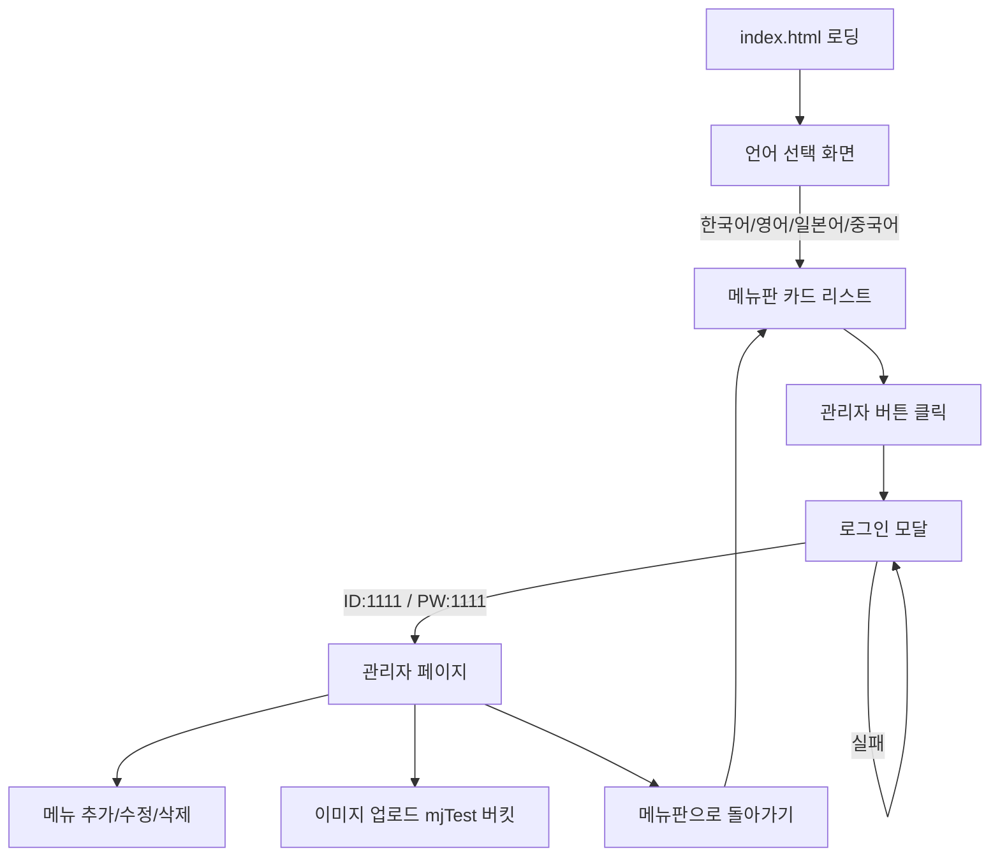

# 다국어 식당 메뉴보드 반응형 웹앱

## 1. Supabase 테이블 수정 (SQL)

현재 테이블에 **메뉴 이름(다국어)** 과 **가격** 컬럼이 없으므로, 아래 SQL을 Supabase SQL Editor에서 실행해야 합니다:

```sql
-- 메뉴 이름 컬럼 추가 (다국어)
ALTER TABLE menu_items ADD COLUMN name_ko text NOT NULL DEFAULT '';
ALTER TABLE menu_items ADD COLUMN name_en text;
ALTER TABLE menu_items ADD COLUMN name_ja text;
ALTER TABLE menu_items ADD COLUMN name_zh text;

-- 가격 컬럼 추가
ALTER TABLE menu_items ADD COLUMN price integer NOT NULL DEFAULT 0;
```

수정 후 최종 테이블 스키마:

| 컬럼         | 타입             | 설명                   |
| ------------ | ---------------- | ---------------------- |
| id           | uuid (PK)        | 고유 식별자            |
| **name_ko**  | text NOT NULL    | 메뉴 이름 (한국어)     |
| **name_en**  | text             | 메뉴 이름 (영어)       |
| **name_ja**  | text             | 메뉴 이름 (일본어)     |
| **name_zh**  | text             | 메뉴 이름 (중국어)     |
| intro_ko     | text NOT NULL    | 메뉴 소개 (한국어)     |
| intro_en     | text             | 메뉴 소개 (영어)       |
| intro_ja     | text             | 메뉴 소개 (일본어)     |
| intro_zh     | text             | 메뉴 소개 (중국어)     |
| **price**    | integer NOT NULL | 가격 (원)              |
| storage_path | text NOT NULL    | 스토리지 이미지 파일명 |
| file_url     | text             | 이미지 URL             |
| created_at   | timestamptz      | 생성 시각              |

기존 데이터 업데이트 예시:

```sql
UPDATE menu_items
SET name_ko = '떡볶이',
    name_en = 'Tteokbokki',
    name_ja = 'トッポッキ',
    name_zh = '炒年糕',
    price = 5000
WHERE storage_path = '167890123_tteokbokki.png';
```

---

## 2. 프로젝트 구조

```
menuboard/
  PROJECT_PLAN.md        -- 프로젝트 전체 계획서 (MCP 역할)
  index.html             -- 메인 진입점 (SPA)
  css/
    style.css            -- 전체 스타일 (반응형)
  js/
    config.js            -- Supabase 설정 (API URL, Key)
    supabase.js          -- Supabase API 호출 래퍼
    app.js               -- 앱 라우팅 및 초기화
    menu.js              -- 고객용 메뉴 페이지 로직
    admin.js             -- 관리자 페이지 로직 (CRUD + 이미지 업로드)
    auth.js              -- 관리자 로그인 인증 로직
```

---

## 3. 페이지 흐름 (SPA 구조)



---

## 4. 주요 기능 상세

### 4-1. 고객용 메뉴 페이지 (`menu.js`)

- **언어 선택 화면**: 4개 국기 아이콘 + 텍스트 버튼 (한국어, English, 日本語, 中文)
- **메뉴 카드 리스트**: 선택한 언어에 맞는 이름/소개 표시
- 카드 구성: 이미지 + 메뉴 이름 + 소개 텍스트 + 가격
- 반응형: PC 3~4열 그리드 / 태블릿 2열 / 모바일 1열
- 하단 또는 헤더에 관리자 버튼 (작고 눈에 띄지 않게)

### 4-2. 관리자 인증 (`auth.js`)

- 모달 팝업으로 ID/PW 입력
- 하드코딩된 인증: ID `1111`, PW `1111`
- sessionStorage에 인증 상태 저장 (탭 닫으면 로그아웃)

### 4-3. 관리자 페이지 (`admin.js`)

- **메뉴 목록 테이블**: 모든 메뉴 항목을 테이블로 표시
- **추가**: 새 메뉴 등록 폼 (이미지 업로드 + 다국어 이름/소개 + 가격)
- **수정**: 인라인 편집 또는 모달 폼으로 각 컬럼 수정
- **삭제**: 확인 후 삭제 (스토리지 이미지도 함께 삭제)
- **이미지 업로드**: `mjTest` 버킷에 파일 업로드 후 URL 자동 생성

### 4-4. Supabase API 연동 (`supabase.js`)

- REST API 직접 호출 (supabase-js SDK 없이 fetch 사용)
- `GET /rest/v1/menu_items` - 메뉴 조회
- `POST /rest/v1/menu_items` - 메뉴 추가
- `PATCH /rest/v1/menu_items?id=eq.{id}` - 메뉴 수정
- `DELETE /rest/v1/menu_items?id=eq.{id}` - 메뉴 삭제
- `POST /storage/v1/object/mjTest/{filename}` - 이미지 업로드
- `DELETE /storage/v1/object/mjTest/{filename}` - 이미지 삭제

---

## 5. UI/UX 디자인 방향

- **메뉴판**: 따뜻한 색감 (식당 분위기), 카드에 그림자와 라운드 코너
- **폰트**: Google Fonts에서 다국어 지원 폰트 (Noto Sans KR/JP/SC)
- **반응형**: CSS Grid + media query 활용
- **관리자 버튼**: 우측 하단 작은 톱니바퀴 아이콘 (고객에게 방해되지 않게)
- **관리자 페이지**: 깔끔한 대시보드 스타일

---

## 6. 기술적 고려사항

- **프레임워크 없음**: 순수 HTML/CSS/JS만 사용 (별도 빌드 불필요)
- **SPA 라우팅**: Hash 기반 (`#menu`, `#admin`) 으로 페이지 전환
- **Supabase RLS**: 현재 비활성 가정 (publishable key로 직접 접근)
- **이미지 업로드 시 파일명**: 타임스탬프 + 원본파일명으로 중복 방지
- **에러 처리**: API 실패 시 사용자 친화적 알림 표시
